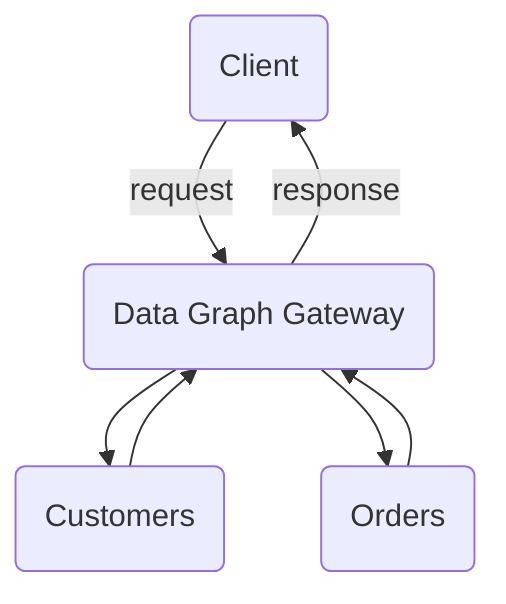

# Apollo GraphQL Federation

Apollo GraphQL Federation demo.

## Installation

1. Make sure you are using the latest Node LTS `nvm use`
2. Install Dependencies `yarn install`
3. Start Federated Services `yarn start-services`
4. Start Gateway (Data Graph) `yarn start-gateway`
