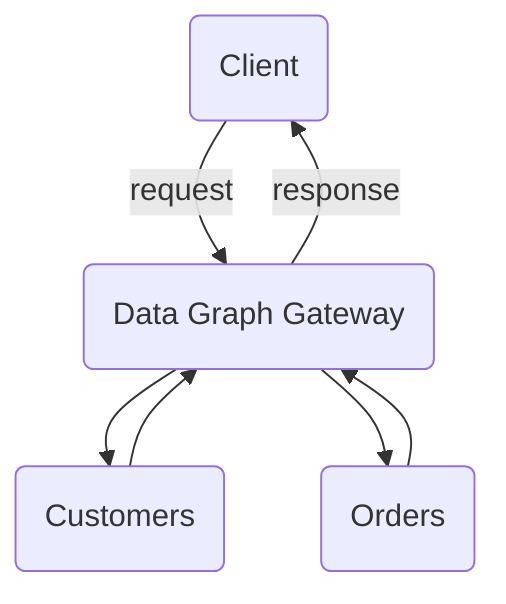

# Apollo GraphQL Federation

Apollo GraphQL Federation demo.

## Installation

1. Install Dependencies `yarn install`
2. Start Federated Services `yarn start-services`
3. Start Gateway (Data Graph) `yarn start-gateway`
