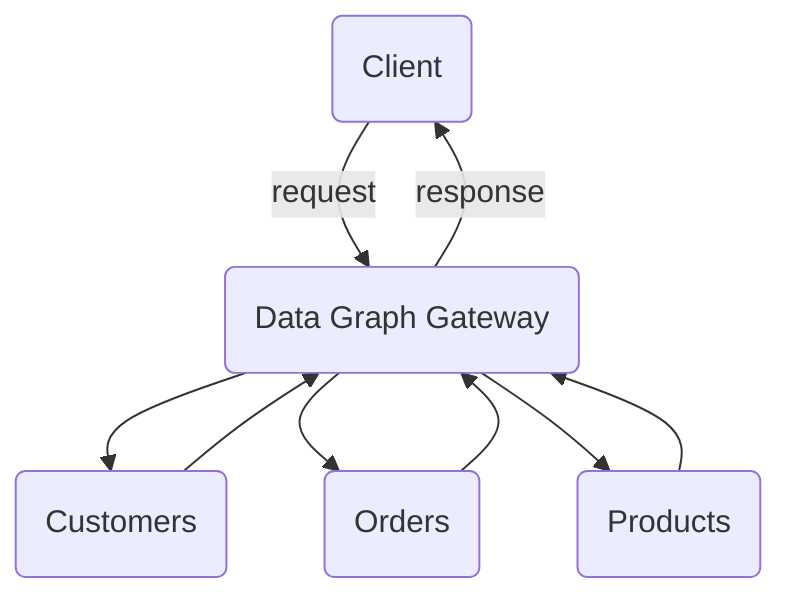

# Apollo GraphQL Federation

Apollo GraphQL Federation demo.



## Installation

1. Make sure you are using the latest Node LTS `nvm use`
2. Install Dependencies `yarn install`
3. Start Federated Services `yarn start-services`
4. Start Gateway (Data Graph) `yarn start-gateway`
5. Visit `http://localhost:4000` in browser to launch GraphQL Playground (Graphiql)

tip: if you need to kill any tcp ports `lsof -ti tcp:<PORT_NAME> | xargs kill`

## Queries and Mutations

### Example Queries

Refer to `DOCS` inside [Graphiql](http://localhost:4000) for more information on queries and muations.

`allOrders`: Retrieve all orders.

```graphql
query {
  allOrders {
    id
    financialStatus
    fulfillmentStatus
    customer {
      id
      firstName
      lastName
      email
    }
  }
}
```

`customerByEmail`: Retrieves customer information by email including all orders placed by customer.

```graphql
query {
  customerByEmail(email: "janedoe@example.com") {
    firstName
    lastName
    email
    orders {
      id
      financialStatus
      fulfillmentStatus
    }
  }
}
```

### Example Mutations

`deleteOrder`: Deletes one order.

```graphql
mutation {
  deleteOrder(id: "order-2") {
    id
    financialStatus
    fulfillmentStatus
    customer {
      id
      firstName
      lastName
      email
    }
  }
}
```

## Built with

- [GraphQL](https://github.com/graphql)
- [Apollo Server](https://github.com/apollographql/apollo-server)
- [Apollo Federation](https://github.com/apollographql/apollo-server/tree/master/packages/apollo-federation)
